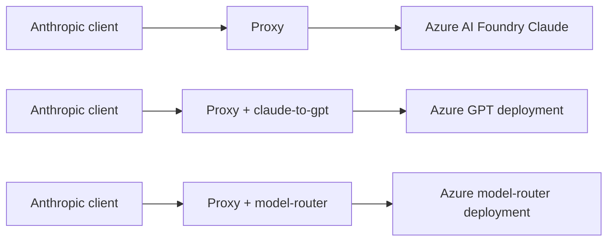
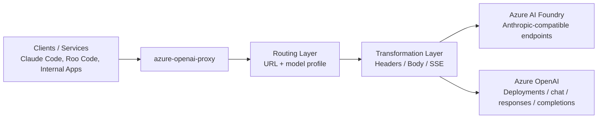
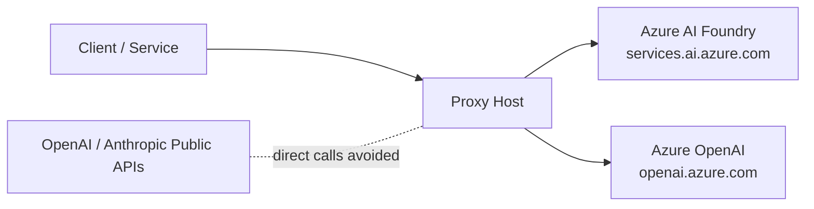
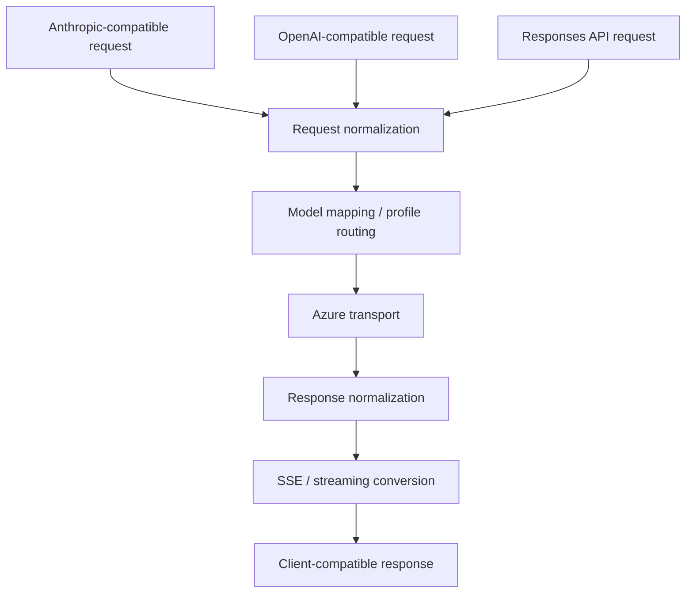

# Azure OpenAI Proxy

English | [한국어](./README.kr.md)

An Azure-first compatibility proxy that places OpenAI-compatible and Anthropic-compatible clients behind Azure AI Foundry and Azure OpenAI.

- Centralize model access through Azure
- Keep existing OpenAI- and Anthropic-style clients
- Support profile-based rerouting such as `claude-to-gpt` and `model-router`
- Include Responses API bridging, SSE conversion, 429 retry handling, and model mapping

## Quick Links

- [Overview](#overview)
- [When to use this](#when-to-use-this)
- [Quick Start](#quick-start)
- [Supported Scenarios](#supported-scenarios)
- [Architecture](#architecture)
- [Configuration](#configuration)
- [Model Profiles](#model-profiles)
- [Running](#running)
- [Client Connection Examples](#client-connection-examples)
- [Routing and Compatibility Rules](#routing-and-compatibility-rules)
- [Verification](#verification)
- [Build](#build)
- [Project Structure](#project-structure)

## Overview

This project is a compatibility proxy for teams using Azure AI Foundry and Azure OpenAI who want to avoid operating separate OpenAI or Anthropic public API integrations. It helps centralize model access on Azure, reduce operational overhead, and minimize direct traffic to public vendor APIs while keeping existing OpenAI-compatible or Anthropic-compatible clients largely unchanged.

> **Key requirement**
>
> This proxy only works with clients or services that allow a **custom base URL**. It fits tools such as Claude Code, Roo Code, internal services, and custom SDK-based applications where the endpoint can be overridden.

## When to use this

- When you already use Azure AI Foundry or Azure OpenAI and want Azure to be the single model access layer
- When you want to avoid operating additional direct integrations with public OpenAI or Anthropic APIs
- When you want to keep Anthropic-compatible or OpenAI-compatible clients while changing the actual backend to Azure-hosted deployments
- When you want to reroute Claude-style requests to GPT deployments or to an Azure `model-router` deployment

### Not a good fit when

- You rely on SaaS products or managed clients that do not allow custom base URLs
- You require strict 100% semantic parity with a vendor’s public API
- Public API usage is already acceptable and Azure-based centralization is unnecessary

## Quick Start

### Prerequisites

- **Node.js is required on Windows, macOS, and Linux**
- An Azure AI Foundry or Azure OpenAI endpoint
- An Azure API key stored in `.env`
- A client or service that supports custom base URLs
- A POSIX shell (`bash`, `zsh`, etc.) if you want to use the `.sh` helper scripts on macOS or Linux

### Install

```bash
npm install
```

### Minimal configuration

`config.yaml`

```yaml
server:
  port: 8081

azure:
  baseUrl: "https://your-resource.services.ai.azure.com"
  openAIBaseUrl: "https://your-resource.openai.azure.com"
  openAIApiVersion: "2024-05-01-preview"
  openAIResponsesApiVersion: "preview"
```

`.env`

```env
AZURE_API_KEY=your-api-key-here
```

### Start by mode

#### Windows

Default mode:

```cmd
scripts\start.bat
```

Claude → GPT mode:

```cmd
scripts\start.bat claude-to-gpt
```

Model-router mode:

```cmd
scripts\start.bat model-router
```

#### macOS / Linux

Default mode:

```bash
./scripts/start.sh
```

Claude → GPT mode:

```bash
./scripts/start.sh claude-to-gpt
```

Model-router mode:

```bash
./scripts/start.sh model-router
```

### Verify

```bash
curl http://localhost:8081/health
```

Expected response:

```json
{"status":"ok","proxy":"azure-openai-proxy"}
```

## Supported Scenarios

### 1) 1:1 compatibility proxy

- Anthropic-compatible requests are forwarded to Azure AI Foundry Anthropic endpoints
- OpenAI-compatible requests are forwarded to Azure OpenAI endpoints
- Clients keep their original protocol while the actual upstream target moves to Azure

### 2) Claude API → Azure GPT deployment

- Accepts Claude-style API requests and converts them into OpenAI Chat Completions requests
- Uses the `claude-to-gpt` profile to map Claude model requests to Azure GPT deployments
- Lets an Anthropic-compatible client talk to GPT-family deployments without changing client protocol

### 3) Claude API → Azure model-router deployment

- Accepts Claude-style API requests and forwards them to an Azure `model-router` deployment
- Delegates the actual model choice to Azure-side routing policy based on the conversation
- The proxy only handles protocol adaptation and profile-based routing

### Scenario comparison



## Architecture

### High-level architecture



The proxy sits between clients and Azure, combining URL-based routing with model-profile-based rerouting to decide the final Azure destination.

### External communication layout



The key point is that clients do not need to call public OpenAI or Anthropic APIs directly. Instead, the proxy centralizes outbound traffic to Azure endpoints.

### Request and response compatibility layers



## Configuration

### `config.yaml`

Configures the server port, Azure endpoints, model mapping, Responses API handling, and profile-based routing.

```yaml
server:
  port: 8081

azure:
  baseUrl: "https://your-resource.services.ai.azure.com"
  openAIBaseUrl: "https://your-resource.openai.azure.com"
  openAIApiVersion: "2024-05-01-preview"
  openAIResponsesApiVersion: "preview"

unsupportedParams:
  - prompt_cache_retention
  - prompt_cache_key

modelNameMap:
  claude-opus-4-6: claude-opus-4-6
  claude-opus-4-5-20251101: claude-opus-4-5
  claude-opus-4-5-20250929: claude-opus-4-6
  claude-sonnet-4-6: claude-sonnet-4-6
  claude-sonnet-4-5: claude-sonnet-4-5
  claude-sonnet-4-5-20250929: claude-sonnet-4-5
  claude-sonnet-4-20250514: claude-sonnet-4-5
  claude-haiku-4-5-20251001: claude-sonnet-4-5
  gpt-5.2-chat: gpt-5.2-chat
  gpt-5.3-codex: gpt-5.3-codex
  gpt-5.4: gpt-5.4
  gpt-5.4-pro: gpt-5.4-pro

nativeResponsesModels:
  - gpt-5.3-codex

completionsModels: []

openAIModels:
  - gpt-5.2-chat
  - gpt-5.3-codex
  - gpt-5.4
  - gpt-5.4-pro

unsupportedAnthropicBetas:
  - prompt-caching-2024-07-31
  - fine-grained-tool-streaming-2025-05-14
  - output-128k-2025-02-19
  - context-1m-2025-08-07

modelProfiles:
  claude-to-gpt:
    modelNameMap:
      claude-opus-4-6: gpt-5.4-pro
      claude-sonnet-4-6: gpt-5.4
    openAIModels:
      - gpt-5.4-pro
      - gpt-5.4

  model-router:
    modelNameMap:
      claude-opus-4-6: model-router
      claude-sonnet-4-6: model-router
      claude-haiku-4-5-20251001: model-router
    openAIModels:
      - model-router
```

### `.env`

```env
AZURE_API_KEY=your-api-key-here
```

Environment overrides:

- `AZURE_API_KEY` - Azure API key
- `AZURE_BASE_URL` - Azure AI Foundry base URL
- `AZURE_OPENAI_BASE_URL` - Azure OpenAI base URL
- `PORT` - Server port
- `PROXY_MODEL_PROFILE` - Active model profile (`default`, `claude-to-gpt`, `model-router`)

## Model Profiles

### `default`

- Maps requested models using the base `modelNameMap`
- Anthropic-compatible requests stay on Anthropic-compatible routes by default

### `claude-to-gpt`

- Remaps Claude model requests to Azure GPT deployments
- Converts Anthropic-style requests into OpenAI Chat Completions requests
- Useful when you want a GPT backend behind an Anthropic-compatible client

Run examples:

```cmd
scripts\start.bat claude-to-gpt
scripts\start-claude-to-gpt.bat
```

```bash
./scripts/start.sh claude-to-gpt
PROXY_MODEL_PROFILE=claude-to-gpt npm start
./scripts/start-claude-to-gpt.sh
```

### `model-router`

- Maps Claude model requests to an Azure `model-router` deployment
- The actual model selection depends on Azure-side deployment policy and conversation context
- The proxy only handles protocol adaptation and profile application

Run examples:

```cmd
scripts\start.bat model-router
scripts\start-model-router.bat
```

```bash
./scripts/start.sh model-router
PROXY_MODEL_PROFILE=model-router npm start
./scripts/start-model-router.sh
```

## Running

### Available modes

| Mode | Description |
|------|------|
| `default` | Standard Azure compatibility proxy mode |
| `claude-to-gpt` | Reroutes Claude-style requests to Azure GPT deployments |
| `model-router` | Reroutes Claude-style requests to an Azure `model-router` deployment |

### Recommended entry points: `start.bat <mode>` / `start.sh <mode>`

Using one launcher with a mode argument is the clearest way to operate the proxy.

#### Windows

```cmd
scripts\start.bat
scripts\start.bat claude-to-gpt
scripts\start.bat model-router
```

#### macOS / Linux

```bash
./scripts/start.sh
./scripts/start.sh claude-to-gpt
./scripts/start.sh model-router
```

### Direct Node.js execution

Default mode:

```bash
npm start
```

Or:

```bash
node src/index.mjs
```

Profile mode:

```bash
PROXY_MODEL_PROFILE=claude-to-gpt npm start
PROXY_MODEL_PROFILE=model-router npm start
```

### Wrapper scripts

These scripts are convenience wrappers around the main mode-based launchers.

#### Windows wrappers

- `scripts\start-claude-to-gpt.bat`
- `scripts\start-model-router.bat`

#### POSIX wrappers

- `./scripts/start-claude-to-gpt.sh`
- `./scripts/start-model-router.sh`

### Launch with Claude Code

Starts the proxy in the background, sets the required environment variables, and launches Claude Code. The proxy is cleaned up automatically when Claude exits.

```cmd
scripts\claude-code.bat
```

### Interactive proxy shell

Starts the proxy in the background and opens an interactive shell with the relevant environment variables set. You can run `claude`, `roo`, or other CLI tools from that shell.

Windows:

```cmd
scripts\proxy-shell.bat
```

macOS / Linux:

```bash
./scripts/proxy-shell.sh
```

### Cross-platform notes

- Windows users also need Node.js. The batch scripts internally run `node src/index.mjs`.
- On macOS / Linux, use `npm start`, `node src/index.mjs`, or the `.sh` helper scripts.
- The Claude Code launcher is currently Windows-oriented. On other operating systems, start the proxy first, export the environment variables, and then run `claude` manually for the same setup.
- On first use, you may need `chmod +x scripts/*.sh`.

### Stop

```cmd
scripts\stop.bat
```

Or press `Ctrl+C` in the running terminal.

## Client Connection Examples

After startup, the console prints a short connection summary.

- **Anthropic API**: `http://localhost:8081/anthropic`
- **OpenAI API**: `http://localhost:8081/openai`
- **API key**: any non-empty value
- **Profile**: current `PROXY_MODEL_PROFILE`
- **Claude Opus / Claude Sonnet**: shown when a selected profile overrides the default mapping

### Anthropic-compatible clients

| Field | Value |
|------|-----|
| Base URL | `http://localhost:8081/anthropic` |
| API Key | any non-empty value |
| Model ID examples | `claude-sonnet-4-6`, `claude-opus-4-6` |

### OpenAI-compatible clients

| Field | Value |
|------|-----|
| Base URL | `http://localhost:8081/openai` |
| API Key | any non-empty value |
| Model ID examples | `gpt-5.4`, `gpt-5.4-pro`, `gpt-5.3-codex` |

### Environment variable example

```cmd
set ANTHROPIC_BASE_URL=http://localhost:8081
set ANTHROPIC_API_KEY=azure-proxy-key
set OPENAI_BASE_URL=http://localhost:8081/openai
set OPENAI_API_KEY=azure-proxy-key
```

## Routing and Compatibility Rules

| Route | Behavior |
|------|------|
| `/anthropic/*` | Azure AI Foundry Anthropic-compatible route |
| `/v1/messages` | Anthropic-compatible messages route, normalized to `/anthropic/v1/messages` |
| `/openai/*` | Azure OpenAI-compatible route |
| `/v1/responses` | OpenAI Responses API route, converted to Chat Completions unless the model is native |
| `/v1/chat/completions` | OpenAI Chat Completions route |
| `/health` | Health check |

### Model-based rerouting

- Even if the incoming request is Anthropic-compatible, it is rerouted to Azure OpenAI when the resolved model is listed in `openAIModels`.
- `claude-to-gpt` and `model-router` are profile-based examples of this rerouting behavior.

### Responses API handling

- Models listed in `nativeResponsesModels` are passed through to Azure Responses API directly.
- Other models convert Responses API requests into Chat Completions requests and then reshape the response back into Responses format.
- Streaming responses also rewrite SSE events into a client-compatible shape.

### Additional compatibility handling

- Removes Azure-unsupported parameters
- Converts `max_tokens` into `max_completion_tokens`
- Filters unsupported `anthropic-beta` headers
- Repairs `tool_use` / `tool_result` sequences
- Normalizes Azure errors into Anthropic-style error envelopes
- Parses wait times from 429 responses and retries automatically

## Verification

At minimum, validate the proxy with the following flow.

1. Verify `/health`
2. Verify one Anthropic-compatible request
3. Verify one OpenAI-compatible request
4. Verify that a Claude-style request is rerouted to a GPT deployment under `claude-to-gpt`
5. Verify that a Claude-style request is mapped to `model-router` under the `model-router` profile
6. If needed, verify `/v1/responses` conversion for both non-stream and stream cases

## Build

Builds a single-file ESM bundle.

```bash
npm run build
```

Or:

```cmd
scripts\build-exe.bat
```

Run the bundled output:

```bash
node dist/proxy.mjs
```

> **Note**
>
> Both the source runtime and the bundled artifact use ESM, and `config.yaml` plus `.env` must be available in the runtime directory when launching the bundled build.

## Project Structure

```text
azure-openai-proxy/
├── package.json
├── config.yaml
├── .env
├── README.md
├── README.kr.md
├── src/
│   ├── index.mjs
│   ├── config.mjs
│   ├── server.mjs
│   ├── proxy.mjs
│   ├── transformers/
│   │   ├── body.mjs
│   │   ├── headers.mjs
│   │   ├── anthropic-to-openai.mjs
│   │   ├── openai-to-anthropic.mjs
│   │   └── responses-to-chat.mjs
│   └── utils/
│       └── logger.mjs
├── scripts/
│   ├── start.bat
│   ├── stop.bat
│   ├── claude-code.bat
│   ├── proxy-shell.bat
│   ├── start-claude-to-gpt.bat
│   ├── start-model-router.bat
│   ├── start.sh
│   ├── start-claude-to-gpt.sh
│   ├── start-model-router.sh
│   ├── proxy-shell.sh
│   └── build-exe.bat
├── test/
│   ├── model-profile.test.mjs
│   └── response-conversion.test.mjs
└── dist/
    └── proxy.mjs
```

## Key Internal Files

- [src/index.mjs](./src/index.mjs) - startup, banner, connection info
- [src/config.mjs](./src/config.mjs) - config loading and profile merge
- [src/server.mjs](./src/server.mjs) - route selection, request normalization, target URL resolution
- [src/proxy.mjs](./src/proxy.mjs) - upstream transport, retry logic, response conversion
- [src/transformers/body.mjs](./src/transformers/body.mjs) - body normalization, message sanitation, token field mapping
- [src/transformers/responses-to-chat.mjs](./src/transformers/responses-to-chat.mjs) - Responses API compatibility layer
- [config.yaml](./config.yaml) - deployment mapping and model profiles
- [scripts/start.sh](./scripts/start.sh) - POSIX foreground launcher
- [scripts/proxy-shell.sh](./scripts/proxy-shell.sh) - POSIX interactive shell launcher
- [test/model-profile.test.mjs](./test/model-profile.test.mjs) - profile routing verification

## License

MIT
