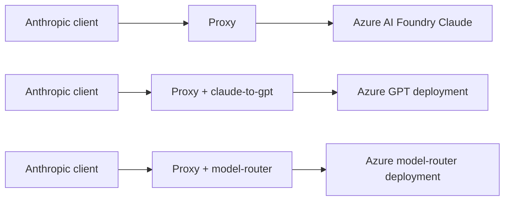
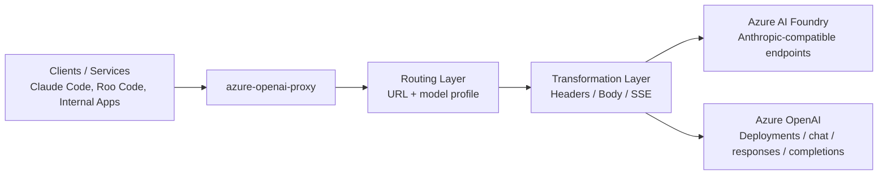
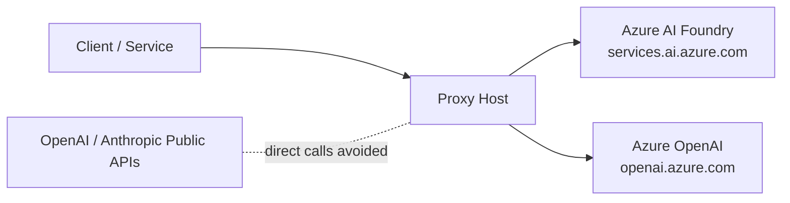
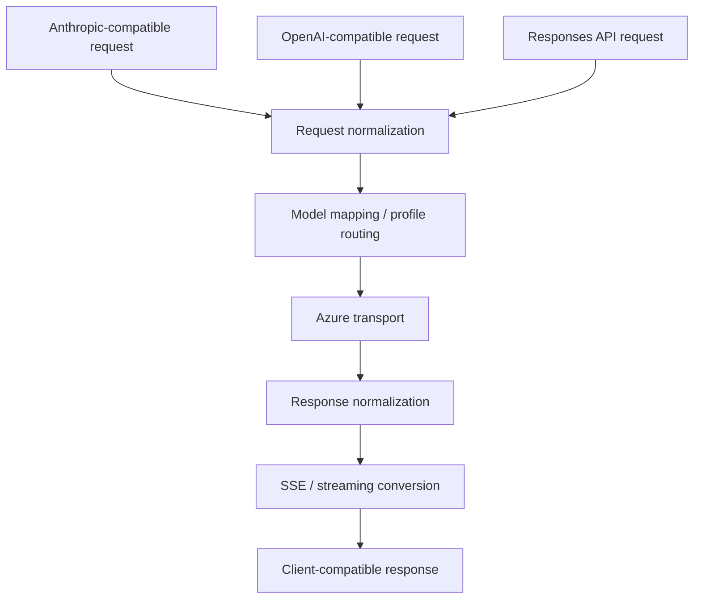

# Azure OpenAI Proxy

한국어 | [English](./README.en.md)


**Azure AI Foundry 또는 Azure OpenAI에 대상 모델/배포가 이미 준비되어 있을 때**, 기존 OpenAI/Anthropic 호환 클라이언트를 그대로 유지하면서 그 호출 대상을 Azure 쪽 모델로 전환하기 위한 Azure 중심 호환 프록시입니다.

- Azure를 단일 모델 접근 지점으로 중앙화
- OpenAI/Anthropic 스타일 클라이언트를 유지한 채 실제 호출 대상을 Azure 배포로 전환
- Claude 모델을 Azure AI Foundry 모델로 사용하거나, Claude 스타일 요청을 Azure GPT / `model-router` 배포로 연결
- Responses API, SSE, 429 재시도, 모델 매핑까지 포함

## Quick Links

- [프로젝트 소개](#프로젝트-소개)
- [언제 쓰면 좋은가](#언제-쓰면-좋은가)
- [빠른 시작](#빠른-시작)
- [사용 흐름](#사용-흐름)
- [지원 시나리오](#지원-시나리오)
- [아키텍처](#아키텍처)
- [설정](#설정)
- [모델 프로필](#모델-프로필)
- [모드와 사용 시나리오 표](#모드와-사용-시나리오-표)
- [실행](#실행)
- [운영 팁](#운영-팁)
- [클라이언트 연결 예시](#클라이언트-연결-예시)
- [라우팅 및 변환 규칙](#라우팅-및-변환-규칙)
- [검증 절차](#검증-절차)
- [빌드](#빌드)
- [프로젝트 구조](#프로젝트-구조)

## 프로젝트 소개

이 프로젝트는 Azure AI Foundry와 Azure OpenAI를 사용하는 환경에서 OpenAI 또는 Anthropic 공식 API를 별도로 중복 운영하지 않고, 비용과 운영 복잡도를 줄이며, 외부 퍼블릭 API로의 직접 통신 경로를 최소화하기 위해 만든 호환 프록시입니다.

기존 OpenAI/Anthropic 호환 클라이언트는 그대로 유지하고, 실제 모델 호출은 Azure 쪽 배포로 일원화하는 것이 목적입니다.

> **핵심 조건**
>
> 1. **Azure AI Foundry 또는 Azure OpenAI에 사용할 모델/배포가 먼저 준비되어 있어야 합니다.**
> 2. 이 프록시는 **사용자 지정 Base URL을 넣을 수 있는 클라이언트/서비스**에서만 사용할 수 있습니다.
>
> 즉, Claude Code, Roo Code, 자체 백엔드, 내부 도구처럼 endpoint를 바꿀 수 있고, 이미 Azure 쪽에 대상 모델 배포가 준비된 경우에 적합합니다.

## 언제 쓰면 좋은가

- Azure AI Foundry 또는 Azure OpenAI를 이미 사용하고 있고, 모델 접근 경로를 Azure로 일원화하고 싶을 때
- OpenAI/Anthropic 공식 API를 추가로 직접 운영하는 부담을 줄이고 싶을 때
- Anthropic/OpenAI 호환 클라이언트를 유지하면서 실제 백엔드는 Azure 배포로 바꾸고 싶을 때
- Claude API 형식 요청을 GPT 배포나 Azure `model-router` 배포로 우회하고 싶을 때

### 적합하지 않은 경우

- Base URL을 변경할 수 없는 SaaS 또는 managed client
- 특정 벤더의 퍼블릭 API와 완전 동일한 의미 체계를 100% 기대하는 경우
- Azure 배포나 profile 관리 없이 바로 public API만 사용하면 되는 경우

## 빠른 시작

### 사전 조건

- **Windows, macOS, Linux 모두 Node.js가 필요합니다**
- **Azure AI Foundry 또는 Azure OpenAI에 이미 생성된 대상 모델/배포**
- 해당 Azure endpoint
- `.env`에 넣을 Azure API key
- Base URL을 직접 설정할 수 있는 클라이언트 또는 서비스
- macOS / Linux에서 `.sh` 스크립트를 쓰려면 POSIX shell (`bash`, `zsh` 등)

### 설치

```bash
npm install
```

### (선택) 초기 설정 스크립트

처음 설정을 더 쉽게 하고 싶다면 대화형 setup 스크립트를 사용할 수 있습니다.

Windows:

```cmd
scripts\setup.bat
```

macOS / Linux:

```bash
./scripts/setup.sh
```

이 스크립트는 다음을 수행합니다:
- Node.js 확인 및 환경 점검
- `.env` 생성 또는 업데이트
- `AZURE_API_KEY` 입력
- Azure AI Foundry endpoint 예시를 보여주고 `AZURE_BASE_URL` 입력
- Azure OpenAI endpoint 예시를 보여주고 `AZURE_OPENAI_BASE_URL` 입력
- 프록시가 사용할 `PORT` 입력
- 활성 시작 모드 선택 (`default`, `claude-to-gpt`, `model-router`)
- URL 형식, 포트 범위, 포트 사용 중 여부, Windows 예약 포트 범위 검증
- 입력한 URL과 API 키 기준으로 연결 확인 결과 표시
- 의존성 자동 설치

입력한 값은 `.env`에 아래 항목으로 저장됩니다:
- `AZURE_API_KEY`
- `AZURE_BASE_URL`
- `AZURE_OPENAI_BASE_URL`
- `PORT`
- `PROXY_MODEL_PROFILE`
- `PROXY_DEFAULT_PROFILE`

### 입력값이 의미하는 것

- `AZURE_API_KEY`: Azure AI Foundry / Azure OpenAI 호출에 사용할 실제 Azure API key입니다.
- `AZURE_BASE_URL`: Azure AI Foundry endpoint입니다. 예: `https://your-resource.services.ai.azure.com`
- `AZURE_OPENAI_BASE_URL`: Azure OpenAI endpoint입니다. 예: `https://your-resource.openai.azure.com`
- `PORT`: 이 프록시가 로컬에서 열 포트입니다. 예: `8081`

이 값들은 보통 Azure 포털에서 이미 만들어 둔 모델/배포와 endpoint 정보를 기준으로 입력합니다.

### 최소 설정

`config.yaml`

```yaml
server:
  port: 8081

azure:
  baseUrl: "https://your-resource.services.ai.azure.com"
  openAIBaseUrl: "https://your-resource.openai.azure.com"
  openAIApiVersion: "2024-05-01-preview"
  openAIResponsesApiVersion: "preview"
```

`.env`

```env
AZURE_API_KEY=your-api-key-here
```

### 모드별 시작

> **참고**
> `.env`에 `PROXY_DEFAULT_PROFILE`이 설정되어 있으면 (`scripts\setup.bat`으로 설정 가능), `start.bat` 또는 `start.sh`를 인자 없이 실행해도 그 프로필이 기본값으로 사용됩니다.

#### Windows

기본 모드: Azure에 준비된 기본 매핑을 그대로 사용하는 일반 호환 프록시 모드

```cmd
scripts\start.bat
```

Claude → GPT 모드: Claude 스타일 요청을 Azure GPT 배포로 변환/재라우팅하는 모드

```cmd
scripts\start.bat claude-to-gpt
```

Model-router 모드: Claude 스타일 요청을 Azure `model-router` 배포로 보내 최종 모델 선택을 Azure에 맡기는 모드

```cmd
scripts\start.bat model-router
```

#### macOS / Linux

기본 모드: Azure에 준비된 기본 매핑을 그대로 사용하는 일반 호환 프록시 모드

```bash
./scripts/start.sh
```

Claude → GPT 모드: Claude 스타일 요청을 Azure GPT 배포로 변환/재라우팅하는 모드

```bash
./scripts/start.sh claude-to-gpt
```

Model-router 모드: Claude 스타일 요청을 Azure `model-router` 배포로 보내 최종 모델 선택을 Azure에 맡기는 모드

```bash
./scripts/start.sh model-router
```

### 확인

```bash
curl http://localhost:8081/health
```

정상 응답 예시:

```json
{"status":"ok","proxy":"azure-openai-proxy"}
```

## 사용 흐름

### Windows 첫 실행

1. `scripts\setup.bat` 실행
2. `AZURE_API_KEY` 입력 또는 기존값 유지
3. 기본 모드를 선택해 `PROXY_DEFAULT_PROFILE`로 저장
4. `scripts\start.bat`으로 프록시 시작
5. 클라이언트를 `http://localhost:8081/anthropic` 또는 `http://localhost:8081/openai`에 연결
6. `/health`와 실제 요청 1건으로 동작 확인

### Windows 반복 실행

1. `scripts\start.bat` 실행
2. 또는 `scripts\start.bat claude-to-gpt`, `scripts\start.bat model-router`로 저장된 기본 모드 덮어쓰기
3. `Ctrl+C` 또는 `scripts\stop.bat`으로 종료

### macOS / Linux 실행

1. `.env` 또는 셸 환경변수에 `AZURE_API_KEY` 설정
2. `./scripts/start.sh <mode>`로 시작
3. 클라이언트를 로컬 프록시 endpoint에 연결
4. `/health`와 실제 요청 1건으로 동작 확인

## 지원 시나리오

### 1) 1:1 호환 프록시

- Anthropic 호환 요청은 Azure AI Foundry Anthropic endpoint로 연결
- OpenAI 호환 요청은 Azure OpenAI endpoint로 연결
- 클라이언트는 기존 프로토콜을 유지하고, 실제 호출 대상만 Azure로 바뀜

### 2) Claude API → Azure GPT 배포

- Claude API 형식 요청을 받아 OpenAI 형식으로 변환하고, 대상 배포에 따라 Chat Completions 또는 Responses로 전달
- `claude-to-gpt` 프로필을 통해 Claude 모델 요청을 Azure GPT 배포로 매핑
- 이미 `gpt-*` 같은 OpenAI 계열 모델 ID로 들어오는 요청도 같은 `modelNameMap` 기준으로 Azure OpenAI deployment에 정규화됨
- Anthropic 호환 클라이언트를 유지한 채 실제 백엔드는 GPT 계열 배포를 사용할 수 있음

### 3) Claude API → Azure model-router 배포

- Claude API 형식 요청을 받아 Azure의 `model-router` 배포로 전달
- 대화 내용에 맞는 실제 모델 선택은 Azure 쪽 배포 정책에 위임
- 프록시는 protocol adaptation과 profile 기반 라우팅만 담당

### 시나리오 비교



## 아키텍처

### 전체 구성



이 프록시는 클라이언트와 Azure 사이에 위치하며, URL 기반 라우팅과 모델 프로필 기반 재라우팅을 조합해 실제 Azure 대상 경로를 결정합니다.

### 외부 통신 구성



핵심 메시지는 클라이언트가 직접 OpenAI/Anthropic 퍼블릭 API를 호출하지 않고, 프록시가 Azure endpoint와만 외부 통신하도록 경로를 단순화한다는 점입니다.

### 요청/응답 변환 레이어



## 설정

### `config.yaml`

서버 포트, Azure endpoint, 모델 매핑, Responses API 처리 방식, 프로필 기반 라우팅을 설정합니다.

```yaml
server:
  port: 8081

azure:
  baseUrl: "https://your-resource.services.ai.azure.com"
  openAIBaseUrl: "https://your-resource.openai.azure.com"
  openAIApiVersion: "2024-05-01-preview"
  openAIResponsesApiVersion: "preview"

unsupportedParams:
  - prompt_cache_retention
  - prompt_cache_key

modelNameMap:
  claude-opus-4-6: claude-opus-4-6
  claude-opus-4-5-20251101: claude-opus-4-5
  claude-opus-4-5-20250929: claude-opus-4-6
  claude-sonnet-4-6: claude-sonnet-4-6
  claude-sonnet-4-5: claude-sonnet-4-5
  claude-sonnet-4-5-20250929: claude-sonnet-4-5
  claude-sonnet-4-20250514: claude-sonnet-4-5
  claude-haiku-4-5-20251001: claude-sonnet-4-5
  gpt-5.2-chat: gpt-5.2-chat
  gpt-5.3-codex: gpt-5.3-codex
  gpt-5.4: gpt-5.4
  gpt-5.4-pro: gpt-5.4-pro

nativeResponsesModels:
  - gpt-5.3-codex
  - gpt-5.4-pro

completionsModels: []

openAIModels:
  - gpt-5.2-chat
  - gpt-5.3-codex
  - gpt-5.4
  - gpt-5.4-pro

unsupportedAnthropicBetas:
  - prompt-caching-2024-07-31
  - fine-grained-tool-streaming-2025-05-14
  - output-128k-2025-02-19
  - context-1m-2025-08-07

modelProfiles:
  claude-to-gpt:
    modelNameMap:
      claude-opus-4-6: gpt-5.4-pro
      claude-opus-4-5-20251101: gpt-5.4-pro
      claude-opus-4-5-20250929: gpt-5.4-pro
      claude-sonnet-4-6: gpt-5.4
      claude-sonnet-4-5: gpt-5.4
      claude-sonnet-4-5-20250929: gpt-5.4
      claude-sonnet-4-20250514: gpt-5.4
      claude-haiku-4-5-20251001: gpt-5.4
    openAIModels:
      - gpt-5.4-pro
      - gpt-5.4

  model-router:
    modelNameMap:
      claude-opus-4-6: model-router
      claude-sonnet-4-6: model-router
      claude-haiku-4-5-20251001: model-router
    openAIModels:
      - model-router
```

### `.env`

```env
AZURE_API_KEY=your-api-key-here
```

환경변수 오버라이드:

- `AZURE_API_KEY` - Azure API key
- `AZURE_BASE_URL` - Azure AI Foundry base URL
- `AZURE_OPENAI_BASE_URL` - Azure OpenAI base URL
- `PORT` - Server port
- `PROXY_MODEL_PROFILE` - Active model profile (`default`, `claude-to-gpt`, `model-router`)

## 모델 프로필

### `default`

- 요청 모델을 기본 `modelNameMap` 기준으로 Azure deployment에 매핑
- Anthropic 호환 요청은 기본적으로 Anthropic 경로 유지

### `claude-to-gpt`

- Claude 모델 요청을 Azure GPT deployment로 재매핑
- Anthropic 형식 요청을 OpenAI 형식으로 변환하고, 대상 배포에 따라 Chat Completions 또는 Responses로 전달
- OpenAI 계열 모델 요청도 동일한 Azure OpenAI deployment 매핑을 유지
- Anthropic 호환 클라이언트를 유지하면서 GPT backend를 사용하고 싶을 때 적합

실행 예시:

```cmd
scripts\start.bat claude-to-gpt
scripts\start-claude-to-gpt.bat
```

```bash
./scripts/start.sh claude-to-gpt
PROXY_MODEL_PROFILE=claude-to-gpt npm start
./scripts/start-claude-to-gpt.sh
```

### `model-router`

- Claude 모델 요청을 Azure `model-router` deployment로 매핑
- 실제 어떤 모델이 선택되는지는 Azure 쪽 배포 정책과 대화 내용에 따라 달라짐
- 프록시는 protocol adaptation과 profile 적용만 담당

실행 예시:

```cmd
scripts\start.bat model-router
scripts\start-model-router.bat
```

```bash
./scripts/start.sh model-router
PROXY_MODEL_PROFILE=model-router npm start
./scripts/start-model-router.sh
```

## 모드와 사용 시나리오 표

| 모드 | 적합한 경우 | 클라이언트 패턴 | 결과 |
|------|------|------|------|
| `default` | 일반적인 Azure 호환 프록시 사용 | 이미 Azure 배포에 맞춰진 OpenAI/Anthropic 호환 클라이언트 | 원래 프로토콜을 유지한 채 Azure 호환 대상에 전달 |
| `claude-to-gpt` | Claude 스타일 클라이언트를 GPT 배포로 연결하고 싶을 때 | Claude Code, Roo Code, 내부 도구 같은 Anthropic 호환 클라이언트 | Claude 스타일 요청을 Azure OpenAI 요청으로 변환하고, 배포에 따라 Chat Completions 또는 Responses로 전달 |
| `model-router` | Azure가 최적 모델을 고르게 하고 싶을 때 | 작업 성격이 자주 바뀌는 Anthropic 호환 클라이언트 | Azure `model-router`로 전달하고 최종 모델 선택은 Azure에 위임 |

## 실행

### 실행 모드

| 모드 | 설명 |
|------|------|
| `default` | 기본 Azure 호환 프록시 모드 |
| `claude-to-gpt` | Claude 스타일 요청을 Azure GPT 배포로 재라우팅 |
| `model-router` | Claude 스타일 요청을 Azure `model-router` 배포로 재라우팅 |

### 권장 진입점: `start.bat <mode>` / `start.sh <mode>`

하나의 시작 스크립트에 모드를 넘기는 방식이 가장 명확합니다.

#### Windows

```cmd
scripts\start.bat
scripts\start.bat claude-to-gpt
scripts\start.bat model-router
```

#### macOS / Linux

```bash
./scripts/start.sh
./scripts/start.sh claude-to-gpt
./scripts/start.sh model-router
```

### 일반 Node.js 실행

기본 모드:

```bash
npm start
```

또는:

```bash
node src/index.mjs
```

프로필 모드:

```bash
PROXY_MODEL_PROFILE=claude-to-gpt npm start
PROXY_MODEL_PROFILE=model-router npm start
```

### Wrapper 스크립트

아래 스크립트들은 메인 모드 실행 스크립트를 감싼 convenience wrapper입니다.

#### Windows wrappers

- `scripts\start-claude-to-gpt.bat`
- `scripts\start-model-router.bat`

#### POSIX wrappers

- `./scripts/start-claude-to-gpt.sh`
- `./scripts/start-model-router.sh`

### Claude Code와 함께 실행

프록시를 백그라운드로 시작하고, 환경변수를 설정한 후 Claude Code를 실행합니다. Claude 종료 시 프록시도 자동으로 정리됩니다.

```cmd
scripts\claude-code.bat
```

### 대화형 셸

프록시를 백그라운드로 시작하고, 환경변수가 설정된 대화형 셸을 엽니다. 이 셸에서 `claude`, `roo`, 기타 CLI 도구를 자유롭게 실행할 수 있습니다.

Windows:

```cmd
scripts\proxy-shell.bat
```

macOS / Linux:

```bash
./scripts/proxy-shell.sh
```

### 크로스플랫폼 메모

- Windows 사용자도 Node.js가 반드시 필요합니다. 배치 파일은 내부적으로 `node src/index.mjs`를 실행합니다.
- macOS / Linux에서는 `npm start`, `node src/index.mjs`, 또는 `.sh` 스크립트를 사용할 수 있습니다.
- Claude Code 자동 실행 배치 파일은 현재 Windows 중심 도우미입니다. 다른 OS에서는 프록시를 먼저 실행한 뒤 환경변수를 설정하고 `claude`를 수동 실행하면 같은 구성이 가능합니다.
- shell 스크립트를 처음 실행할 때는 `chmod +x scripts/*.sh`가 필요할 수 있습니다.

### 중지

```cmd
scripts\stop.bat
```

또는 실행 중인 터미널에서 `Ctrl+C`

## 운영 팁

### 시작 모드 우선순위

실제 시작 모드는 아래 순서로 결정됩니다.

1. CLI 인자 (`start.bat model-router`, `start.sh claude-to-gpt`)
2. 인자 없이 `start.bat`를 실행했을 때 `.env`의 `PROXY_DEFAULT_PROFILE`
3. `default`

현재 POSIX launcher는 `.env`의 `PROXY_DEFAULT_PROFILE`을 직접 읽지 않으므로, macOS / Linux에서는 모드 인자를 명시하거나 helper script 바깥에서 `PROXY_MODEL_PROFILE`을 직접 설정하는 편이 안전합니다.

### 환경변수 역할

- `PROXY_DEFAULT_PROFILE` - Windows setup / batch launcher에서 저장해두는 기본 프로필
- `PROXY_MODEL_PROFILE` - Node.js 프로세스가 실제로 사용하는 런타임 프로필
- `AZURE_API_KEY` - 다른 방식으로 제공하지 않는 한 필수

### 자주 확인할 항목

- 시작 직후 실패하면 Node.js가 설치되어 있고 `PATH`에서 보이는지 확인
- 프록시는 뜨지만 요청이 실패하면 `config.yaml`, Azure endpoint, `AZURE_API_KEY` 확인
- 다른 백엔드로 라우팅되면 mode 인자 또는 저장된 `PROXY_DEFAULT_PROFILE` 확인
- macOS / Linux에서 처음 shell script를 쓰면 `chmod +x scripts/*.sh` 실행

## 클라이언트 연결 예시

프록시 시작 후 콘솔에는 다음과 같은 연결 요약 정보가 표시됩니다.

- **Anthropic API**: `http://localhost:8081/anthropic`
- **OpenAI API**: `http://localhost:8081/openai`
- **API key**: any non-empty value
- **Profile**: current `PROXY_MODEL_PROFILE`
- **Claude Opus / Claude Sonnet / Claude Haiku**: shown when a selected profile overrides the default mapping

### Anthropic 호환 클라이언트

| 항목 | 값 |
|------|-----|
| Base URL | `http://localhost:8081/anthropic` |
| API Key | any non-empty value |
| Model ID examples | `claude-sonnet-4-6`, `claude-opus-4-6` |

### OpenAI 호환 클라이언트

| 항목 | 값 |
|------|-----|
| Base URL | `http://localhost:8081/openai` |
| API Key | any non-empty value |
| Model ID examples | `gpt-5.4`, `gpt-5.4-pro`, `gpt-5.3-codex` |

### 환경변수 예시

```cmd
set ANTHROPIC_BASE_URL=http://localhost:8081
set ANTHROPIC_API_KEY=azure-proxy-key
set OPENAI_BASE_URL=http://localhost:8081/openai
set OPENAI_API_KEY=azure-proxy-key
```

### Claude Code setup example

If you want Claude Code to use the Anthropic-compatible side of the proxy, set it like this before launching `claude`:

```bash
export ANTHROPIC_BASE_URL=http://localhost:8081
export ANTHROPIC_API_KEY=azure-proxy-key
claude
```

Windows Command Prompt:

```cmd
set ANTHROPIC_BASE_URL=http://localhost:8081
set ANTHROPIC_API_KEY=azure-proxy-key
claude
```

Or use the helper launcher on Windows:

```cmd
scripts\claude-code.bat
```

### Roo Code setup example

#### Roo Code with Anthropic provider

Use this when you want Roo Code to send Claude-style requests through the proxy.

| Field | Value |
|------|-----|
| Provider | Anthropic |
| Base URL | `http://localhost:8081/anthropic` |
| API Key | any non-empty value |
| Model examples | `claude-sonnet-4-6`, `claude-opus-4-6` |

#### Roo Code with OpenAI provider

Use this when you want Roo Code to send OpenAI-style requests through the proxy.

| Field | Value |
|------|-----|
| Provider | OpenAI |
| Base URL | `http://localhost:8081/openai` |
| API Key | any non-empty value |
| Model examples | `gpt-5.4`, `gpt-5.4-pro`, `gpt-5.3-codex` |

### Client setup notes

- For Claude Code, the root `ANTHROPIC_BASE_URL=http://localhost:8081` works because the proxy normalizes `/v1/messages`
- For Anthropic-compatible UI tools such as Roo Code, using `http://localhost:8081/anthropic` is usually the clearest option
- For OpenAI-compatible clients, use `http://localhost:8081/openai`
- The proxy accepts any non-empty client API key and handles the real Azure credential upstream

## 라우팅 및 변환 규칙

| 경로 | 설명 |
|------|------|
| `/anthropic/*` | Azure AI Foundry Anthropic-compatible route |
| `/v1/messages` | Anthropic-compatible messages route, normalized to `/anthropic/v1/messages` |
| `/openai/*` | Azure OpenAI-compatible route |
| `/v1/responses` | OpenAI Responses API route, converted to Chat Completions unless the model is native |
| `/v1/chat/completions` | OpenAI Chat Completions route |
| `/health` | Health check |

### 모델 기반 재라우팅

- Anthropic 형식 요청이라도 모델이 `openAIModels`에 포함되면 OpenAI 형식으로 변환 후 Azure OpenAI 쪽으로 재라우팅됩니다.
- 기본 `gpt-*` 요청은 이 규칙으로 그대로 Azure OpenAI 쪽으로 가고, `claude-to-gpt`는 여기에 Claude → GPT 매핑을 추가합니다.
- `model-router`는 같은 재라우팅 규칙을 `model-router` deployment까지 확장하는 예시입니다.

### Responses API 처리

- `nativeResponsesModels`에 포함된 모델은 Azure Responses API로 직접 전달됩니다.
- 그 외 모델은 Responses API request를 Chat Completions request로 바꾸고, 응답도 다시 Responses 형식으로 복원합니다.
- 스트리밍 시에는 SSE event shape도 client-compatible format으로 다시 변환됩니다.

### `claude-to-gpt` 세부 변환

- `claude-to-gpt` 프로필에서 `claude-opus-4-6`은 기본 예시 기준 `gpt-5.4-pro`로 매핑되며, 이 배포가 `nativeResponsesModels`에 있으면 `/openai/v1/responses` 경로를 사용합니다.
- 같은 프로필에서 `claude-sonnet-4-6`, `claude-sonnet-4-5`, `claude-haiku-4-5-20251001` 같은 Claude 계열 별칭도 기본 예시 기준 `gpt-5.4`로 매핑되며, `nativeResponsesModels`에 없으면 `/chat/completions` 경로를 사용합니다.
- Anthropic `system`은 먼저 OpenAI chat `messages[].role="system"`으로 정규화되고, Responses 경로에서는 다시 `instructions`로 옮겨집니다.
- Anthropic `tool_use`는 OpenAI chat `tool_calls`로 정규화된 뒤, Responses 경로에서는 `function_call` item으로 변환됩니다.
- Anthropic `tool_result`는 OpenAI chat `tool` message로 정규화된 뒤, Responses 경로에서는 `function_call_output` item으로 변환됩니다.
- Responses 경로에서 `user` 텍스트는 `input_text`, `assistant` 텍스트는 `output_text`, 사용자 이미지 입력은 `input_image`로 변환됩니다.
- Anthropic `metadata.user_id`가 OpenAI `user`로 이어질 때, Native Responses 경로에서는 Azure 제한에 맞춰 길이 64자 이하만 유지하고 더 긴 값은 드롭합니다.
- Anthropic `POST /v1/messages/count_tokens`가 GPT 배포로 재라우팅되는 경우에는 Azure OpenAI에 동일한 Anthropic 토큰 카운트 endpoint가 없으므로, 프록시가 로컬 휴리스틱으로 `input_tokens`를 계산해 반환합니다.
- 출력 토큰 필드는 경로에 따라 달라집니다. Chat Completions 경로는 `max_completion_tokens`, native Responses 경로는 `max_output_tokens`를 사용합니다.
- upstream 응답도 경로에 맞게 복원됩니다. Chat Completions 응답은 Anthropic message/SSE로, native Responses 응답도 Anthropic message/SSE로 다시 변환됩니다.

### 추가 호환성 처리

- Azure 미지원 파라미터 제거
- `max_tokens` → `max_completion_tokens` 또는 `max_output_tokens` 변환
- Native Responses 경로에서 64자를 넘는 `user` 값 드롭
- `anthropic-beta` 필터링
- `tool_use` / `tool_result` 보정
- Azure 에러를 Anthropic 에러 형식으로 정규화
- 429 응답에서 대기 시간을 파싱해 자동 재시도

## 검증 절차

최소한 아래 흐름으로 동작을 확인하는 것을 권장합니다.

1. `/health` 호출 확인
2. Anthropic-compatible request 1건 확인
3. OpenAI-compatible request 1건 확인
4. `claude-to-gpt` 프로필로 Claude-style request가 GPT deployment로 재라우팅되는지 확인
5. `model-router` 프로필로 Claude-style request가 `model-router` deployment로 매핑되는지 확인
6. 필요 시 `/v1/responses` non-stream / stream 변환 확인

## 빌드

단일 ESM 번들을 생성합니다.

```bash
npm run build
```

또는:

```cmd
scripts\build-exe.bat
```

번들 실행:

```bash
node dist/proxy.mjs
```

> **참고**
>
> 소스와 번들 모두 ESM 기반이며, 번들 실행 시 `config.yaml`과 `.env` 파일이 실행 디렉토리에 있어야 합니다.

## 프로젝트 구조

```text
azure-openai-proxy/
├── package.json
├── config.yaml
├── .env
├── README.md
├── README.en.md
├── src/
│   ├── index.mjs
│   ├── config.mjs
│   ├── server.mjs
│   ├── proxy.mjs
│   ├── transformers/
│   │   ├── body.mjs
│   │   ├── headers.mjs
│   │   ├── anthropic-to-openai.mjs
│   │   ├── openai-to-anthropic.mjs
│   │   ├── responses-to-chat.mjs
│   │   └── responses-to-anthropic.mjs
│   └── utils/
│       └── logger.mjs
├── scripts/
│   ├── start.bat
│   ├── stop.bat
│   ├── claude-code.bat
│   ├── proxy-shell.bat
│   ├── start-claude-to-gpt.bat
│   ├── start-model-router.bat
│   ├── start.sh
│   ├── start-claude-to-gpt.sh
│   ├── start-model-router.sh
│   ├── proxy-shell.sh
│   ├── setup.bat
│   └── build-exe.bat
├── test/
│   ├── model-profile.test.mjs
│   ├── request-conversion.test.mjs
│   ├── response-conversion.test.mjs
│   └── retry-strategy.test.mjs
└── dist/
    └── proxy.mjs
```

## 핵심 파일

- [src/index.mjs](./src/index.mjs) - startup, banner, connection info
- [src/config.mjs](./src/config.mjs) - config loading and profile merge
- [src/server.mjs](./src/server.mjs) - route selection, request normalization, target URL resolution
- [src/proxy.mjs](./src/proxy.mjs) - upstream transport, retry logic, response conversion
- [src/transformers/body.mjs](./src/transformers/body.mjs) - body normalization, message sanitation, token field mapping
- [src/transformers/responses-to-chat.mjs](./src/transformers/responses-to-chat.mjs) - Responses API compatibility layer
- [src/transformers/responses-to-anthropic.mjs](./src/transformers/responses-to-anthropic.mjs) - native Responses → Anthropic response/SSE conversion
- [config.yaml](./config.yaml) - deployment mapping and model profiles
- [scripts/start.sh](./scripts/start.sh) - POSIX foreground launcher
- [scripts/proxy-shell.sh](./scripts/proxy-shell.sh) - POSIX interactive shell launcher
- [test/model-profile.test.mjs](./test/model-profile.test.mjs) - profile routing verification

## 라이선스

MIT
