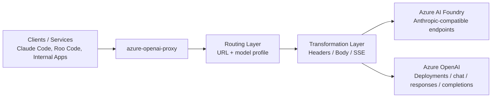
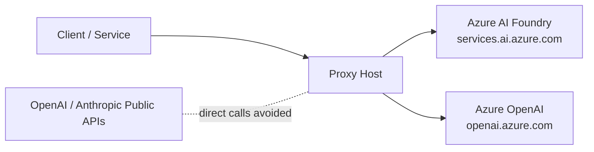
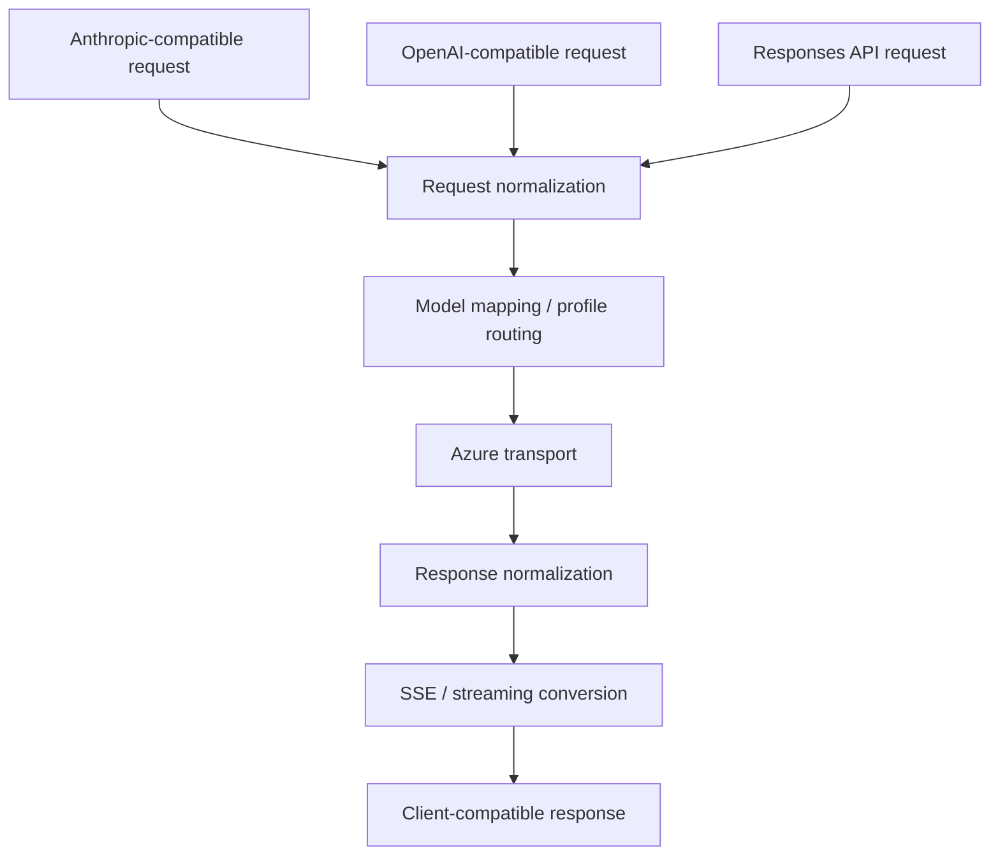
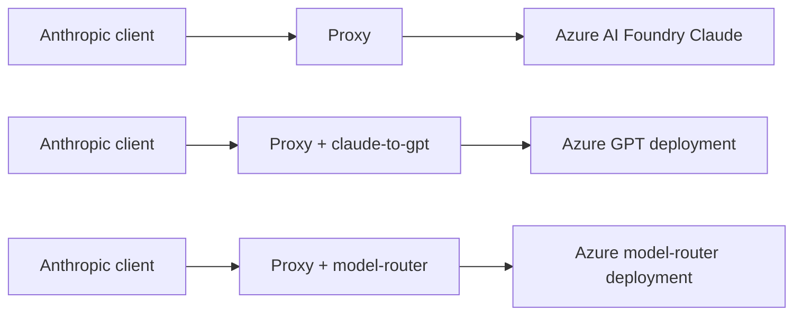

# Azure OpenAI Proxy

## 프로젝트 소개 / Overview

이 프로젝트는 Azure AI Foundry와 Azure OpenAI를 사용하는 환경에서 OpenAI 또는 Anthropic 공식 API를 별도로 중복 운영하지 않고, 비용과 운영 복잡도를 줄이며, 외부 퍼블릭 API로의 직접 통신 경로를 최소화하기 위해 만든 호환 프록시입니다. 기존 OpenAI/Anthropic 호환 클라이언트는 그대로 유지하고, 실제 모델 호출은 Azure 쪽 배포로 일원화하는 것이 목적입니다.

This project is a compatibility proxy for teams using Azure AI Foundry and Azure OpenAI who want to avoid operating separate OpenAI or Anthropic public API integrations. It helps centralize model access on Azure, reduce operational overhead, and minimize direct traffic to public vendor APIs while keeping existing OpenAI-compatible or Anthropic-compatible clients largely unchanged.

> **핵심 조건 / Key requirement**
>
> 이 프록시는 **사용자 지정 Base URL을 넣을 수 있는 클라이언트/서비스**에서만 사용할 수 있습니다. Claude Code, Roo Code, 자체 백엔드, 내부 도구처럼 endpoint를 바꿀 수 있는 경우에 적합합니다.
>
> This proxy only works with clients or services that allow a **custom base URL**. It fits tools such as Claude Code, Roo Code, internal services, and custom SDK-based applications where the endpoint can be overridden.

## 언제 쓰면 좋은가 / When this is useful

- Azure AI Foundry 또는 Azure OpenAI를 이미 사용하고 있고, 모델 접근 경로를 Azure로 일원화하고 싶을 때
- OpenAI/Anthropic 공식 API를 추가로 직접 운영하는 부담을 줄이고 싶을 때
- Anthropic/OpenAI 호환 클라이언트를 유지하면서 실제 백엔드는 Azure 배포로 바꾸고 싶을 때
- Claude API 형식 요청을 GPT 배포나 Azure model-router 배포로 우회하고 싶을 때

- When you already use Azure AI Foundry or Azure OpenAI and want Azure to be the single model access layer
- When you want to avoid operating additional direct integrations with public OpenAI or Anthropic APIs
- When you want to keep Anthropic-compatible or OpenAI-compatible clients while changing the actual backend to Azure-hosted deployments
- When you want to reroute Claude-style requests to GPT deployments or to an Azure model-router deployment

## 지원 시나리오 / Supported scenarios

### 1) 1:1 호환 프록시 / 1:1 compatibility proxy

- Anthropic 호환 요청은 Azure AI Foundry Anthropic endpoint로 연결
- OpenAI 호환 요청은 Azure OpenAI endpoint로 연결
- 클라이언트는 기존 프로토콜을 유지하고, 실제 호출 대상만 Azure로 바뀜

- Anthropic-compatible requests are forwarded to Azure AI Foundry Anthropic endpoints
- OpenAI-compatible requests are forwarded to Azure OpenAI endpoints
- Clients keep their original protocol while the actual upstream target moves to Azure

### 2) Claude API → Azure GPT 배포 / Claude API to Azure GPT deployment

- Claude API 형식 요청을 받아 OpenAI Chat Completions 형식으로 변환
- `claude-to-gpt` 프로필을 통해 Claude 모델 요청을 Azure GPT 배포로 매핑
- Anthropic 호환 클라이언트를 유지한 채 실제 백엔드는 GPT 계열 배포를 사용할 수 있음

- Accepts Claude-style API requests and converts them into OpenAI Chat Completions requests
- Uses the `claude-to-gpt` profile to map Claude model requests to Azure GPT deployments
- Lets an Anthropic-compatible client talk to GPT-family deployments without changing client protocol

### 3) Claude API → Azure model-router 배포 / Claude API to Azure model-router deployment

- Claude API 형식 요청을 받아 Azure의 `model-router` 배포로 전달
- 대화 내용에 맞는 실제 모델 선택은 Azure 쪽 배포 정책에 위임
- 프록시는 protocol adaptation과 profile 기반 라우팅만 담당

- Accepts Claude-style API requests and forwards them to an Azure `model-router` deployment
- Delegates the actual model choice to Azure-side routing policy based on the conversation
- The proxy only handles protocol adaptation and profile-based routing

## 빠른 시작 / Quick Start

### 사전 조건 / Prerequisites

- Node.js
- Azure AI Foundry 또는 Azure OpenAI endpoint
- `.env`에 넣을 Azure API key
- Base URL을 직접 설정할 수 있는 클라이언트 또는 서비스
- Windows 배치 파일을 쓰지 않는 경우 POSIX shell (`bash`, `zsh` 등) 또는 일반 Node 실행 환경

- Node.js
- An Azure AI Foundry or Azure OpenAI endpoint
- An Azure API key stored in `.env`
- A client or service that supports custom base URLs
- A POSIX shell (`bash`, `zsh`, etc.) or a plain Node.js runtime when not using the Windows batch scripts

### 설치 / Install

```bash
npm install
```

### 최소 설정 / Minimal configuration

`config.yaml`

```yaml
server:
  port: 8081

azure:
  baseUrl: "https://your-resource.services.ai.azure.com"
  openAIBaseUrl: "https://your-resource.openai.azure.com"
  openAIApiVersion: "2024-05-01-preview"
  openAIResponsesApiVersion: "preview"
```

`.env`

```env
AZURE_API_KEY=your-api-key-here
```

### 실행 / Run

가장 단순한 방식은 OS와 상관없이 Node로 직접 실행하는 것입니다.

The simplest cross-platform option is to run the proxy directly with Node.

```bash
npm start
```

또는 / or:

```bash
node src/index.mjs
```

Windows 배치 스크립트:

```cmd
scripts\start.bat
```

macOS / Linux shell 스크립트:

```bash
./scripts/start.sh
```

### 확인 / Verify

```bash
curl http://localhost:8081/health
```

정상 응답 예시 / Expected response:

```json
{"status":"ok","proxy":"azure-openai-proxy"}
```

## 시스템 구성도 / System architecture

### 전체 구성 / High-level architecture



이 프록시는 클라이언트와 Azure 사이에 위치하며, URL 기반 라우팅과 모델 프로필 기반 재라우팅을 조합해 실제 Azure 대상 경로를 결정합니다.

The proxy sits between clients and Azure, combining URL-based routing with model-profile-based rerouting to decide the final Azure destination.

### 외부 통신 구성 / External communication layout



핵심 메시지는 클라이언트가 직접 OpenAI/Anthropic 퍼블릭 API를 호출하지 않고, 프록시가 Azure endpoint와만 외부 통신하도록 경로를 단순화한다는 점입니다.

The key point is that clients do not need to call public OpenAI or Anthropic APIs directly. Instead, the proxy centralizes outbound traffic to Azure endpoints.

### 요청/응답 변환 레이어 / Request and response compatibility layers



이 레이어는 Anthropic, OpenAI, Responses API 형태의 요청을 Azure가 처리 가능한 형태로 바꾸고, 다시 클라이언트가 기대하는 형식으로 복원합니다.

This layer converts Anthropic, OpenAI, and Responses-style requests into Azure-compatible requests, then reshapes responses back into the protocol expected by the client.

### 시나리오 비교 / Scenario comparison



## 적용 가능 조건 / Requirements and scope

### 사용할 수 있는 경우 / Works well when

- Base URL을 바꿀 수 있는 클라이언트 또는 서비스
- Anthropic/OpenAI 호환 API를 사용하는 내부 도구
- Azure 쪽 endpoint와 deployment를 이미 관리하고 있는 조직

- Clients or services that allow base URL overrides
- Internal tools built against Anthropic-compatible or OpenAI-compatible APIs
- Teams already managing Azure endpoints and deployments

### 적합하지 않은 경우 / Not a good fit when

- Base URL을 변경할 수 없는 SaaS 또는 managed client
- 특정 벤더의 퍼블릭 API와 완전 동일한 의미 체계를 100% 기대하는 경우
- Azure 배포나 profile 관리 없이 바로 public API만 사용하면 되는 경우

- SaaS products or managed clients that do not allow custom base URLs
- Workloads that require strict 100% semantic parity with a vendor’s public API
- Setups where public API usage is already acceptable and Azure-based centralization is unnecessary

## 설정 / Configuration

### config.yaml

서버 포트, Azure endpoint, 모델 매핑, Responses API 처리 방식, 프로필 기반 라우팅을 설정합니다.

Configures the server port, Azure endpoints, model mapping, Responses API handling, and profile-based routing.

```yaml
server:
  port: 8081

azure:
  baseUrl: "https://your-resource.services.ai.azure.com"
  openAIBaseUrl: "https://your-resource.openai.azure.com"
  openAIApiVersion: "2024-05-01-preview"
  openAIResponsesApiVersion: "preview"
  # apiKey is loaded from .env

unsupportedParams:
  - prompt_cache_retention
  - prompt_cache_key

modelNameMap:
  claude-opus-4-6: claude-opus-4-6
  claude-opus-4-5-20251101: claude-opus-4-5
  claude-opus-4-5-20250929: claude-opus-4-6
  claude-sonnet-4-6: claude-sonnet-4-6
  claude-sonnet-4-5: claude-sonnet-4-5
  claude-sonnet-4-5-20250929: claude-sonnet-4-5
  claude-sonnet-4-20250514: claude-sonnet-4-5
  claude-haiku-4-5-20251001: claude-sonnet-4-5
  gpt-5.2-chat: gpt-5.2-chat
  gpt-5.3-codex: gpt-5.3-codex
  gpt-5.4: gpt-5.4
  gpt-5.4-pro: gpt-5.4-pro

nativeResponsesModels:
  - gpt-5.3-codex

completionsModels: []

openAIModels:
  - gpt-5.2-chat
  - gpt-5.3-codex
  - gpt-5.4
  - gpt-5.4-pro

unsupportedAnthropicBetas:
  - prompt-caching-2024-07-31
  - fine-grained-tool-streaming-2025-05-14
  - output-128k-2025-02-19
  - context-1m-2025-08-07

modelProfiles:
  claude-to-gpt:
    modelNameMap:
      claude-opus-4-6: gpt-5.4-pro
      claude-sonnet-4-6: gpt-5.4
    openAIModels:
      - gpt-5.4-pro
      - gpt-5.4

  model-router:
    modelNameMap:
      claude-opus-4-6: model-router
      claude-sonnet-4-6: model-router
      claude-haiku-4-5-20251001: model-router
    openAIModels:
      - model-router
```

### .env

```env
AZURE_API_KEY=your-api-key-here
```

환경변수 오버라이드 / Environment overrides:

- `AZURE_API_KEY` - Azure API key
- `AZURE_BASE_URL` - Azure AI Foundry base URL
- `AZURE_OPENAI_BASE_URL` - Azure OpenAI base URL
- `PORT` - Server port
- `PROXY_MODEL_PROFILE` - Active model profile (`default`, `claude-to-gpt`, `model-router`)

## 모델 프로필 / Model profiles

### `default`

- 요청 모델을 기본 `modelNameMap` 기준으로 Azure deployment에 매핑
- Anthropic 호환 요청은 기본적으로 Anthropic 경로 유지

- Maps requested models using the base `modelNameMap`
- Anthropic-compatible requests stay on Anthropic-compatible routes by default

### `claude-to-gpt`

- Claude 모델 요청을 Azure GPT deployment로 재매핑
- Anthropic 형식 요청을 OpenAI Chat Completions 형식으로 변환
- Anthropic 호환 클라이언트를 유지하면서 GPT backend를 사용하고 싶을 때 적합

- Remaps Claude model requests to Azure GPT deployments
- Converts Anthropic-style requests into OpenAI Chat Completions requests
- Useful when you want a GPT backend behind an Anthropic-compatible client

실행 예시 / Run example:

```cmd
scripts\start-claude-to-gpt.bat
```

또는 / or:

```cmd
scripts\start.bat claude-to-gpt
```

```bash
PROXY_MODEL_PROFILE=claude-to-gpt npm start
```

또는 / or:

```bash
./scripts/start-claude-to-gpt.sh
```

### `model-router`

- Claude 모델 요청을 Azure `model-router` deployment로 매핑
- 실제 어떤 모델이 선택되는지는 Azure 쪽 배포 정책과 대화 내용에 따라 달라짐
- 프록시는 protocol adaptation과 routing profile 적용만 담당

- Maps Claude model requests to an Azure `model-router` deployment
- The actual model selection depends on Azure-side deployment policy and conversation context
- The proxy only handles protocol adaptation and profile application

실행 예시 / Run example:

```cmd
scripts\start-model-router.bat
```

또는 / or:

```cmd
scripts\start.bat model-router
```

```bash
PROXY_MODEL_PROFILE=model-router npm start
```

또는 / or:

```bash
./scripts/start-model-router.sh
```

## 실행 / Running the proxy

### 방법 1 / Option 1: 포그라운드 실행 / Foreground run

Windows:

```cmd
scripts\start.bat
```

Cross-platform:

```bash
npm start
```

또는 / or:

```bash
node src/index.mjs
```

macOS / Linux helper script:

```bash
./scripts/start.sh
```

### 방법 2 / Option 2: Claude Code와 함께 실행 / Launch with Claude Code

프록시를 백그라운드로 시작하고, 환경변수를 설정한 후 Claude Code를 실행합니다. Claude 종료 시 프록시도 자동으로 정리됩니다.

Starts the proxy in the background, sets the required environment variables, and launches Claude Code. The proxy is cleaned up automatically when Claude exits.

```cmd
scripts\claude-code.bat
```

### 방법 3 / Option 3: 대화형 셸 / Interactive proxy shell

프록시를 백그라운드로 시작하고, 환경변수가 설정된 대화형 셸을 엽니다. 이 셸에서 `claude`, `roo`, 기타 CLI 도구를 자유롭게 실행할 수 있습니다.

Starts the proxy in the background and opens an interactive shell with the relevant environment variables set. You can run `claude`, `roo`, or other CLI tools from that shell.

Windows:

```cmd
scripts\proxy-shell.bat
```

macOS / Linux:

```bash
./scripts/proxy-shell.sh
```

### 크로스플랫폼 메모 / Cross-platform notes

- Windows에서는 `.bat` 스크립트를 그대로 사용할 수 있습니다.
- macOS / Linux에서는 `npm start`, `node src/index.mjs`, 또는 새로 추가된 `.sh` 스크립트를 사용할 수 있습니다.
- Claude Code 자동 실행 배치 파일은 현재 Windows 중심 도우미입니다. 다른 OS에서는 프록시를 먼저 실행한 뒤 환경변수를 설정하고 `claude`를 수동 실행하면 같은 구성이 가능합니다.
- shell 스크립트를 처음 실행할 때는 `chmod +x scripts/*.sh`가 필요할 수 있습니다.

- On Windows, you can use the existing `.bat` launcher scripts.
- On macOS / Linux, use `npm start`, `node src/index.mjs`, or the new `.sh` helper scripts.
- The Claude Code launcher is currently Windows-oriented. On other operating systems, start the proxy first, export the environment variables, and then run `claude` manually for the same setup.
- On first use, you may need `chmod +x scripts/*.sh`.

### 중지 / Stop

```cmd
scripts\stop.bat
```

또는 실행 중인 터미널에서 `Ctrl+C`

Or press `Ctrl+C` in the running terminal.

## 클라이언트 연결 예시 / Client connection examples

프록시 시작 후 콘솔에는 다음과 같은 연결 요약 정보가 표시됩니다.

After startup, the console prints a short connection summary.

- **Anthropic API**: `http://localhost:8081/anthropic`
- **OpenAI API**: `http://localhost:8081/openai`
- **API key**: any non-empty value
- **Profile**: current `PROXY_MODEL_PROFILE`
- **Claude Opus / Claude Sonnet**: shown when a selected profile overrides the default mapping

### Anthropic 호환 클라이언트 / Anthropic-compatible clients

| 항목 / Field | 값 / Value |
|------|-----|
| Base URL | `http://localhost:8081/anthropic` |
| API Key | any non-empty value |
| Model ID examples | `claude-sonnet-4-6`, `claude-opus-4-6` |

### OpenAI 호환 클라이언트 / OpenAI-compatible clients

| 항목 / Field | 값 / Value |
|------|-----|
| Base URL | `http://localhost:8081/openai` |
| API Key | any non-empty value |
| Model ID examples | `gpt-5.4`, `gpt-5.4-pro`, `gpt-5.3-codex` |

### 환경변수 예시 / Environment variable example

```cmd
set ANTHROPIC_BASE_URL=http://localhost:8081
set ANTHROPIC_API_KEY=azure-proxy-key
set OPENAI_BASE_URL=http://localhost:8081/openai
set OPENAI_API_KEY=azure-proxy-key
```

## 라우팅 및 변환 규칙 / Routing and transformation rules

| 경로 / Route | 설명 / Behavior |
|------|------|
| `/anthropic/*` | Azure AI Foundry Anthropic-compatible route |
| `/v1/messages` | Anthropic-compatible messages route, normalized to `/anthropic/v1/messages` |
| `/openai/*` | Azure OpenAI-compatible route |
| `/v1/responses` | OpenAI Responses API route, converted to Chat Completions unless the model is native |
| `/v1/chat/completions` | OpenAI Chat Completions route |
| `/health` | Health check |

### 모델 기반 재라우팅 / Model-based rerouting

- Anthropic 형식 요청이라도 모델이 `openAIModels`에 포함되면 OpenAI 형식으로 변환 후 Azure OpenAI 쪽으로 재라우팅됩니다.
- `claude-to-gpt`와 `model-router`는 이 재라우팅 규칙을 프로필로 확장한 예시입니다.

- Even if the incoming request is Anthropic-compatible, it is rerouted to Azure OpenAI when the resolved model is listed in `openAIModels`.
- `claude-to-gpt` and `model-router` are profile-based examples of this rerouting behavior.

### Responses API 처리 / Responses API handling

- `nativeResponsesModels`에 포함된 모델은 Azure Responses API로 직접 전달됩니다.
- 그 외 모델은 Responses API request를 Chat Completions request로 바꾸고, 응답도 다시 Responses 형식으로 복원합니다.
- 스트리밍 시에는 SSE event shape도 client-compatible format으로 다시 변환됩니다.

- Models listed in `nativeResponsesModels` are passed through to Azure Responses API directly.
- Other models convert Responses API requests into Chat Completions requests and then reshape the response back into Responses format.
- Streaming responses also rewrite SSE events into a client-compatible shape.

### 추가 호환성 처리 / Additional compatibility handling

- Azure 미지원 파라미터 제거
- `max_tokens` → `max_completion_tokens` 변환
- `anthropic-beta` 필터링
- `tool_use` / `tool_result` 보정
- Azure 에러를 Anthropic 에러 형식으로 정규화
- 429 응답에서 대기 시간을 파싱해 자동 재시도

- Removes Azure-unsupported parameters
- Converts `max_tokens` into `max_completion_tokens`
- Filters unsupported `anthropic-beta` headers
- Repairs `tool_use` / `tool_result` sequences
- Normalizes Azure errors into Anthropic-style error envelopes
- Parses wait times from 429 responses and retries automatically

## 검증 절차 / Smoke verification

최소한 아래 흐름으로 동작을 확인하는 것을 권장합니다.

At minimum, validate the proxy with the following flow.

1. `/health` 호출 확인
2. Anthropic-compatible request 1건 확인
3. OpenAI-compatible request 1건 확인
4. `claude-to-gpt` 프로필로 Claude-style request가 GPT deployment로 재라우팅되는지 확인
5. `model-router` 프로필로 Claude-style request가 `model-router` deployment로 매핑되는지 확인
6. 필요 시 `/v1/responses` non-stream / stream 변환 확인

1. Verify `/health`
2. Verify one Anthropic-compatible request
3. Verify one OpenAI-compatible request
4. Verify that a Claude-style request is rerouted to a GPT deployment under `claude-to-gpt`
5. Verify that a Claude-style request is mapped to `model-router` under the `model-router` profile
6. If needed, verify `/v1/responses` conversion for both non-stream and stream cases

## 빌드 / Build

단일 ESM 번들을 생성합니다.

Builds a single-file ESM bundle.

```bash
npm run build
```

또는 / or:

```cmd
scripts\build-exe.bat
```

번들 실행 / Run the bundled output:

```bash
node dist/proxy.mjs
```

> **참고 / Note**
>
> 소스와 번들 모두 ESM 기반이며, 번들 실행 시 `config.yaml`과 `.env` 파일이 실행 디렉토리에 있어야 합니다.
>
> Both the source runtime and the bundled artifact use ESM, and `config.yaml` plus `.env` must be available in the runtime directory when launching the bundled build.

## 프로젝트 구조 / Project structure

```text
azure-openai-proxy/
├── package.json
├── config.yaml
├── .env
├── README.md
├── src/
│   ├── index.mjs
│   ├── config.mjs
│   ├── server.mjs
│   ├── proxy.mjs
│   ├── transformers/
│   │   ├── body.mjs
│   │   ├── headers.mjs
│   │   ├── anthropic-to-openai.mjs
│   │   ├── openai-to-anthropic.mjs
│   │   └── responses-to-chat.mjs
│   └── utils/
│       └── logger.mjs
├── scripts/
│   ├── start.bat
│   ├── stop.bat
│   ├── claude-code.bat
│   ├── proxy-shell.bat
│   ├── start-claude-to-gpt.bat
│   ├── start-model-router.bat
│   └── build-exe.bat
├── test/
│   ├── model-profile.test.mjs
│   └── response-conversion.test.mjs
└── dist/
    └── proxy.mjs
```

## 핵심 파일 / Key internal files

- [src/index.mjs](src/index.mjs) - startup, banner, connection info
- [src/config.mjs](src/config.mjs) - config loading and profile merge
- [src/server.mjs](src/server.mjs) - route selection, request normalization, target URL resolution
- [src/proxy.mjs](src/proxy.mjs) - upstream transport, retry logic, response conversion
- [src/transformers/body.mjs](src/transformers/body.mjs) - body normalization, message sanitation, token field mapping
- [src/transformers/responses-to-chat.mjs](src/transformers/responses-to-chat.mjs) - Responses API compatibility layer
- [config.yaml](config.yaml) - deployment mapping and model profiles
- [scripts/start.sh](scripts/start.sh) - POSIX foreground launcher
- [scripts/proxy-shell.sh](scripts/proxy-shell.sh) - POSIX interactive shell launcher
- [test/model-profile.test.mjs](test/model-profile.test.mjs) - profile routing verification

## 의존성 / Dependencies

- **js-yaml** - YAML config parsing
- **esbuild** (dev) - single-file bundling

Node.js built-in modules are used wherever possible to keep runtime dependencies minimal.

## 라이선스 / License

MIT
